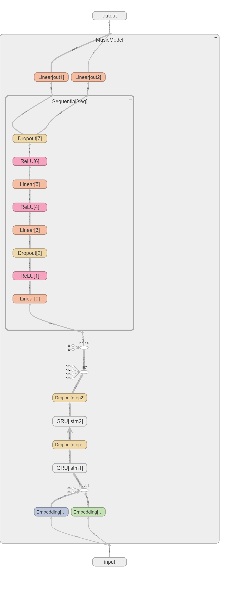
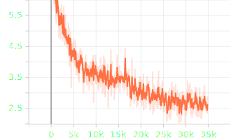
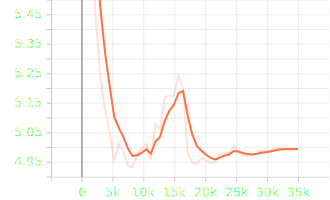

# Piano Music Generation using GRU
Generating music using a neural network has always been a fascinating task.
This repository showcases one such neural network which  is able to produce somewhat nice results.

## Model Architecture
The model leverages the GRU architecture.
For indepth analysis do checkout the [training notebook](./MusicGen.ipynb)

## Training
The model was trained on the midi music of [Frédéric Chopin
](https://en.wikipedia.org/wiki/Fr%C3%A9d%C3%A9ric_Chopin) from the [Classical Music MIDI](https://www.kaggle.com/datasets/soumikrakshit/classical-music-midi?select=albeniz)
available on Kaggle. It contains 48 music pieces.

The model was trained for 46 epochs.

## Results
These are the training and validation loss curves respectively.

Training_loss

Validation_loss

## Predictions

To generate your own pieces I would suggest you to open the [prediction.ipynb](prediction.ipynb) in Google Colab and run it there.

*You can git clone the repository there.*

Here are some of the generated music pieces.

* Prediction 1
  
https://github.com/user-attachments/assets/796a2ef9-c25c-4542-aa08-ab004356cca0

* Prediction 2

https://github.com/user-attachments/assets/135ce48b-296c-4a2e-b357-fa86b1dc432d

* Prediction 3

https://github.com/user-attachments/assets/0534938b-67f6-4f11-8cb1-f5ee9068d8e8

* Prediction 4

https://github.com/user-attachments/assets/48ec8900-c446-4564-acb1-7f19dbb2233f

* prediction 5 

https://github.com/user-attachments/assets/1db5b399-ff81-4f08-8acc-e5fa7b3767b1

## Help Me Benchmark It

If you have listened to all these prediction please share your review by filling this [form](https://forms.gle/6JqQzFy8KrzDQByCA) 

Thank You
